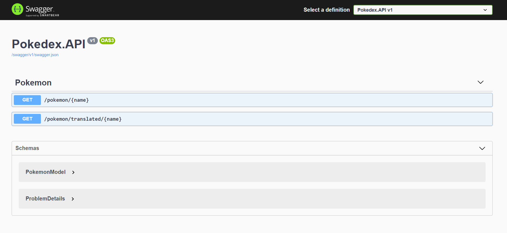

<div align="center">
	
	<br>
    <br>
    <h1>Pokedex Web API</h1>
    <p>
		<b>Simple .NET 5 implementation of a service that provides pokemon information.</b>
	</p>
    <br>
</div>

This repo contains an example of a REST API implemented in .NET Core using clean architecture principles and containerized with Docker. The service was developed keeping a pokemon domain in mind, but the principles used can easily be applied to design .NET Core based web APIs for any domain. For simplicity, we're using [PokeAPI](https://pokeapi.co/) to retrive pokemon information instead of a custom database.  


**Tech Stack:** [.NET 5](https://docs.microsoft.com/en-us/aspnet/core/web-api/?view=aspnetcore-5.0), [Docker](https://docs.microsoft.com/en-us/aspnet/core/host-and-deploy/docker/?view=aspnetcore-5.0), [Refit](https://github.com/reactiveui/refit), [AutoMapper](https://github.com/AutoMapper/AutoMapper), [Moq](https://github.com/Moq/moq4/wiki/Quickstart)

## Prerequisites

To run the app locally, you'd need to have **either** of the following installed on your machine:

1. [Docker Desktop](https://docs.docker.com/desktop/#download-and-install) - can build a docker image and spin up a container running the app locally. 
2. [.NET 5 SDK](https://dotnet.microsoft.com/download/dotnet/5.0) - can use the dotnet CLI or visual studio to build and run the app.

## Running Locally

We first need to get a local copy of this repository either by cloning or downloading the zip files.

If you want to run the app without using command line, you can open the `Pokedex.sln` file and directly run in Visual Studio.

Once you have a localy copy, open up your terminal/command prompt at the **root** of this repo and navigate to the `Pokedex` solution folder.

### Dotnet CLI

The following commands will launch the app on http://localhost:5000

```bash
> cd Pokedex.API
> dotnet run
```

### Docker

The following commands will build the image and run the app in a docker container.

```bash
> docker build -t pokedex-api .
> docker run -it --rm -p 5000:80 pokedex-api
```

This will run on: http://localhost:5000

You can now test the endpoints using any HTTP client tool like cURL, Postman, httpie etc.

Example using [httpie](https://httpie.io/):

```bash
> http http://localhost:5000/pokemon/pikachu
> http http://localhost:5000/pokemon/translated/pikachu
```


## Endpoints

Once you run the app, you should be able access the public routes below:

Feature | Type | Route | Access
------------ | ------------- | ------------- | -------------
Get Pokemon Details | GET | http://localhost:5000/pokemon/:name | Public
Get Pokemon with translated description | GET | http://localhost:5000/pokemon/translated/:name | Public


**Example Response Model**:

```json
{
    "description": "Their electricity could build and cause lightning storms.",
    "habitat": "forest",
    "isLegendary": false,
    "name": "pikachu"
}
```

Swagger documentation is also configured. More information on the API endpoints and responses can be accessed at this endpoint: 

```url
http://localhost:5000/swagger
```



## Architecture

Used [Clean Architecture](https://docs.microsoft.com/en-us/dotnet/architecture/modern-web-apps-azure/common-web-application-architectures#clean-architecture) approach to organize code into 3 projects.

**Pokedex.Application.Core**

This project contains only core domain entities (POCO), business logic and required interface abstractions. It is the inner most layer and **should not** have any dependency on outside layers.

- _Entities/PokemonEntity.cs_ - This is a POCO class that is used to represent information of a single pokemon.
- _Services/PokemonService.cs_ - This uses the client interfaces to get the data and applies the business logic of using the correct translation etc.
- _Clients/IPokeAPIClient.cs_ - Interface exposing a method to fetch pokemon species from an external source. We don't need to worry about the implementation details of this interface at this layer, it's responsibility of Infrastructure layer. The external source now happens to be PokeAPI, as long as this interface is maintained, it can be easily changed to another source without having to change the PokemonService.


With dependencies injected, it's simple to mock them in unit tests and test only the core business logic.

For this example, the client interfaces and external models are defined in this layer. But for production, I would have created a much more generic interface and models such as 'IPokemonRepository' instead of directly calling it `IPokeAPIClient`. The infrastructure layer, would implement the interface and can convert the external models into domain specific models. 

**Pokedex.Infrastructure**

This layer contains implementations of any interfaces defined in Application.Core that require talking to external systems or data sources. Typically, it should have an implementation of PokeAPIClient and FunTranslationsClient i.e. code that makes http requests and serializes/deserializes requests and responses into external models. 

To avoid writing http request making code in this example, `Refit` library was used. It allows us to dynamically create implementations of API Clients based on interfaces.

The following code in `DependencyInjection.cs` class of this project, is used to inject the implementation of the client at runtime in Startup.cs of the API layer.

```csharp
services
    .AddRefitClient<IPokeAPIClient>()
    .ConfigureHttpClient(c => c.BaseAddress = new Uri("https://pokeapi.co/api/v2"));
```

Only a single instance of the client is created and used throughout the application wherever `IPokeAPIClient` dependency is passed in the constructor.

**Pokedex.API**

This is the outer most 'presentation' layer. It includes the following:

- _PokemonController.cs_ - Defines the API routes and is the entry point. All Application.Core dependencies are injected via constructor and only interfaces are used throughout. The response models are mapped from the business entities and sent back in the response.

- _PokemonModel.cs_ - Domain entities might have properties/information that we don't want to expose to the client, hence it they're converted to this model and sent back as the response.

- _Startup.cs_ - Configures the application and dependency injection.

AutoMapper has been used to simplify creation of API models from domain entities.

There are multiple deployment options for this application such as hosting in a container independently (AWS ECS or Azure Container Service), adding to an existing Kubernetes cluster etc. We can re-use the inner layers and convert the entire presentation layer into a new serverless API project, if needed. The architecture is flexible.


## Unit Tests

**Pokedex.Application.Core.Test.Unit** includes unit tests for the core business logic.

The tests can be run either through Visual Studio or dotnet CLI.

```bash
> cd Pokedex
> dotnet test
```

## Production Ready?

... Not yet.

The following a few things to consider adding before taking this to production.

**External Services Response Caching**

We can cache the responses we recieve from external services such as PokeAPI and FunTranslations. This can improve performance of the app and could reduce the number of requests we make. If the third party service charges us on the number of requests, then caching could result in cost savings. It depends on the types of requests we make, some can't be cached. In this case, the response includes pokemon information and translation which are unlikely to change often for given input.

The cache can be in-memory of the app or using an internal service like Reddis.

**Request Model Validation**

The input request models don't have any validation at the moment. It works with both id (int) and name (string). Having some validation of the input models before passing the data into inner layers or external systems is a good safety measure.

**PokeAPI Response Model Deserialization**

Currently some values like language, habitat are stored as string. In code to verify we're doing something like `.Language == "en"` and `.Habitat == "cave"`. It would be an improvement to see if we can map these strings to Enum when we deserialize, so we don't have to hardcode such strings in code.

**Making it Resilient**

When making calls to anything outside of our application such as external thrid party services or data sources, our application has to be fault tolerant. Dependent services can be down, fail, rate limited etc. We need to handle our logic to either fallback to a default value, have a retry policy with a circuit breaker pattern or design internal systems with asynchronous communication that use message queues. 

Currently, if FunTranslation service fails due to rate-limit, then we fallback to use a standard description. But, if PokeAPI service fails, we throw an exception. Instead of throwing an exception we can even log it and fallback to a default value. Either way, we would like to see the exceptions in a some monitoring dashboard.

Perhaps for this case, a simple retry policy with default fallback and logging should be good enough.

**Monitoring**

Having a monitoring solution in place is extremely important for any deployed production service. What kind of monitoring platform we use largely depends on the overall system architecture and where it's deployed to. 

If deployed to azure app service or container instances, we can use Azure Application Insights. If we're deploying to microservices in a cluster, we can use Prometheue.

It's important we are able to monitor and detect any performance issues, failures, exceptions, memory usage etc. 

**Service Health Endpoints**

Adding on to monitoring above, having service health endpoints are also important. These could simple operation to test connectivity of data source or external service. If returns 200 OK, means all infrastructure is working fine. For example, we can use tools like WatchDog, to be able to monitor health of microservices.

**Authentication and Authorization**

At the moment, anyone can make requests to this application. Adding an auth mechanism will restrict who can make the requests. The implementation for this largely depends on the overall system architecture. If there is an API gateway, then that can handle the auth and perhaps pass JWTs to internal services which the microservices can validate with a middleware in place. 

**Additional things to consider:**

- Versioning the API
- Rate Limiting
- Setup CI/CD Pipeline based on deployment infrastructure. 